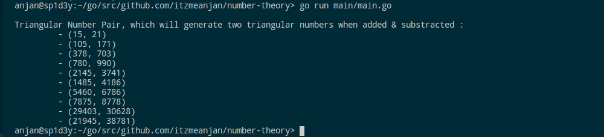

# number-theory

Programmatically implementing some Number Theory things :wink:

## motivation

Recently I stumbled upon a Number-Thoery book, which grabbed my interest pretty quick & I thought about implementing those concepts programmatically. So I started this repo, where I'll keep adding implemented problem-solution pairs, which might be helpful to you. Well I'm planning to stick to GoLang as language of implementation.

**Consider contributing to this repo** :wink:

## implementation

### Triangular Numbers

- Find _X_-th Triangular Number _( formula based, iterative & recursive )_
- Check whether a given number is Triangular or not
- Verify that sum of reciprocals of first _N_ Triangular Numbers, tends to _2_, as _N_ increases
- Verify that, after 3 next _X_, triangular numbers are Composite _( non-prime )_
- Finding first _X_ Triangular Numbers, which are Square too
- Verify whether sum & difference of two distinct Triangular Numbers is Triangular or not
- Get all Triangular Numbers ( from first _X_, where _X_ denotes position of Triangular Number in Series ), which can be represented as a sum of two distinct Triangular Numbers
- Get _X_ Triangular Number Pairs, such that when added & substracted, both of them will be Triangular
- Represent all +ve integers under 1001, as sum of _<= 3_ Triangular Numbers

### Square Numbers

- Return _N_-th Square Number
- Checking whether a given number is Square or not

### Oblong Number

- Return _N_-th oblong number
- Check whether a given number is Oblong or not

### Classify given number _N_

- Given a number _N_, classify it into any of one category among three below categories.

#### Deficient Numbers

Given a number _X_, we find all factors of _X_ ( lesser than X ), if sum of those factors, is lesser than _X_, then it's _Deficient Number_

#### Perfect Numbers

Given a number _X_, we find all factors of _X_ ( lesser than X ), if sum of those factors, is equals to _X_, then it's _Perfect Number_

#### Abundant Numbers

Given a number _X_, we find all factors of _X_ ( lesser than X ), if sum of those factors, is greater than _X_, then it's _Abundant Number_

**More to come ...**
